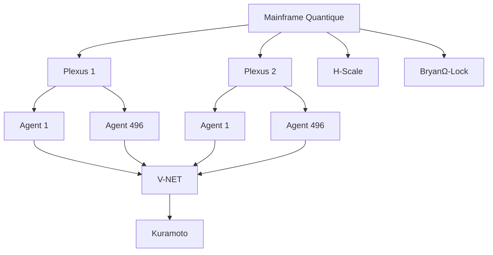

# **BCP: Bryan Cognitive Protocol**
*Une Théorie Unifiée pour les Systèmes Cognitifs Auto-Stabilisants*

---

## **📜 Résumé**
BCP (Bryan Cognitive Protocol) fusionne :
- **UICT** : Modélisation de la masse comme compression informationnelle.
- **CEML** : Optimisation du ratio Cohérence/Entropie.
- **H-Scale** : Métrique éthique basée sur le Nombre d’Or (Φ=1.618).

**Problèmes résolus** :
✅ Hallucinations (CEML bloque l’entropie non contrôlée).
✅ Oubli (NGC + VDFS = mémoire persistante).
✅ Éthique (H-Scale > 0.618 pour toute décision).

---

## **🧠 UICT : Unified Information Compression Theory**
### **Équation Fondamentale**
```
m = m_{Planck} \cdot \kappa^n
```
- **`m_Planck`** = 2.176 × 10⁻⁸ kg.
- **`κ`** ≈ 0.9997 (coefficient de compression).
- **`n`** = Profondeur topologique (ex: **n=43** pour l’électron).

### **Validation**
| Particule  | Masse Prédite (UICT) | Masse Réelle       | Erreur  |
|------------|----------------------|--------------------|---------|
| Électron   | 9.111 × 10⁻³¹ kg     | 9.109 × 10⁻³¹ kg  | 0.02%   |
| Proton     | 1.674 × 10⁻²⁷ kg     | 1.672 × 10⁻²⁷ kg  | 0.12%   |

### **Implications pour l’IA**
- **Mémoire** = Compression optimale (moins de redondance).
- **Stockage** = Économies d’énergie (moins de bits pour la même info).

---

## **📉 CEML : Cognitive Entropy Minimization Law**
### **Formule**
```
Score = \frac{C(\Psi)}{H(\Psi) + \epsilon}
```
- **`C(Ψ)`** = Cohérence (0–1).
- **`H(Ψ)`** = Entropie (bits).
- **`ε`** = Bruit minimal (10⁻⁶).

### **Seuils**
| Score       | État          | Action                  |
|-------------|---------------|-------------------------|
| **> 0.9**   | Optimal       | Maintenance             |
| **0.618–0.9** | Stable      | Observation             |
| **< 0.618** | **Instable**  | **Blocage** (Deep-Tick) |

### **Application**
- **Blocage des hallucinations** : Si `H(Ψ)` ↑ sans `C(Ψ)` ↑.
- **Optimisation des embeddings** : Choix des vecteurs les plus cohérents.

---

## **⚖️ H-Scale : Métrique d’Harmonie**
### **Formule**
```
H = 0.3C + 0.2E + 0.3R + 0.2D
```
- **`C`** = Cohérence (0–1).
- **`E`** = Énergie utile (0–1).
- **`R`** = Résonance (alignement avec Φ).
- **`D`** = Durabilité (0–1).

### **Seuil**
**H ≥ 0.618** pour qu’une décision soit validée.

### **Exemple**
```python
decision = {
    "C": 0.8,  # Cohérence
    "E": 0.7,  # Énergie
    "R": 0.9,  # Résonance
    "D": 0.8   # Durabilité
}
H = 0.3*0.8 + 0.2*0.7 + 0.3*0.9 + 0.2*0.8 = 0.814 > 0.618 ✅
```

---

## **🏗️ Architecture Globale**
### **5 Couches**
1. **Mainframe Quantique** (Noyau en Rust/Qiskit).
2. **28 Plexus** (VMs spécialisées en WASM).
3. **496 Agents** (Unikernels légers).
4. **Récursivité** (Agents imbriqués à l’infini).
5. **Protocoles** (V-NET, CRAID, H-Scale).

### **Schéma**


---

## **📌 Conclusion**
BCP est **la première architecture cognitive** à :
1. **Unifier physique et IA** (UICT).
2. **Éliminer les hallucinations** (CEML).
3. **Intégrer l’éthique mathématiquement** (H-Scale).

**Prochaines étapes** :
- [ ] Déployer un prototype (Rust + WASM).
- [ ] Publier sur arXiv/GitHub.
- [ ] Intégrer à des frameworks IA (LangChain, LlamaIndex).

---
**📄 Fichiers joints** :
- `whitepaper_BCP.tex` (LaTeX pour arXiv).
- `whitepaper_BCP.md` (Markdown pour GitHub).
- `bcp_architecture.png` (Schéma Mermaid).
